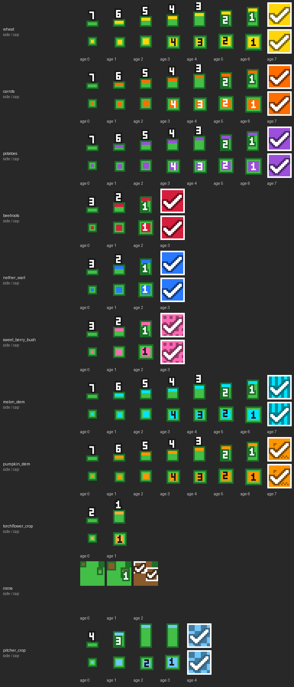

# easy-to-distinguish-crops

A Minecraft: Java Edition resource pack that makes it obvious **which crop is which, how far it has grown, and whether it is ready to harvest**, even from a distance. Looks are sacrificed for readability on purpose.

Minecraft Java 版のリソースパック。**作物が育ち切ったかどうかを、遠目でも一瞬で分かるようにする**。
見た目が小麦らしいかどうかは捨てて、「何の作物か」「あと何段階か」「収穫できるか」だけを最優先に描いている。



## English

**How to read it**

- **Not ready:** a green bar. Its height is the growth progress. The tip of the bar and the center of the top cap show the crop's color. The white digit is the number of growth stages left.
- **Ready to harvest:** a solid box in the crop's color with a white check mark, visible from the side and from above. It pulses between the crop color and white (about once per second) and is rendered at full brightness at night or under a roof (`light_emission: 15` on the model elements; stems excluded).
- Crop colors: wheat = yellow, carrots = orange, potatoes = purple, beetroots = red, nether wart = blue, sweet berries = pink with dots, cocoa = brown, pitcher crop = light blue checker, melon stem = cyan stripes, pumpkin stem = orange with a jack-o'-lantern face. Stems do not pulse (they sit at the final stage while waiting to grow a fruit). Torchflower seedlings only get the "not ready" look; the torchflower itself is vanilla.
- Carrots and potatoes use all 8 growth stages (vanilla shares 4 textures between them), so the bar grows one step at a time.

**Install**

- Download the zip from [Releases](../../releases) and drop it into `.minecraft/resourcepacks/`, or clone this repository into that folder (`pack.mcmeta` is at the repository root, so the folder works as a pack as is).
- Enable it in Options → Resource Packs.

**Versions**

- Built for 1.21.11 (resource pack format 75) through 26.3 (format 97.1). `pack.mcmeta` declares `min_format: 75` / `max_format: 97`.
- Models carry both `shade: false` (up to 26.2) and `shade_direction_override: "up"` (26.3+), so the flat, unshaded look works on both sides of that change.
- Newer versions will show an "older version" warning; the pack still loads. Bump `MAX_FORMAT` in `tools/gen.py` and regenerate to silence it.

**Customize / build**

Everything under `assets/` is generated by `tools/gen.py` (Python 3 + Pillow). Edit the `CROPS` table (`color`, `pulse`, `glow`, `motif`), then run `python tools/gen.py` and `python tools/validate.py`.

No vanilla textures or models are included; the pack only references vanilla block state names. MIT licensed. Not an official Minecraft product; not approved by or associated with Mojang or Microsoft.

## 日本語

## 見た目のルール

| 状態 | 見た目 |
|---|---|
| 未成熟 | **緑の棒**。棒の高さ＝成長の進み具合（低い＝植えたばかり、高い＝もうすぐ）。棒の先端と上面の中心が **作物色**。白い数字は **収穫可能まであと何段階**。 |
| 成熟（収穫可） | **作物色の箱＋白い✓**。全面が不透明で、上面も作物色になるので見下ろしても分かる。さらに **作物色 ⇄ 白 で明滅**する（約 1 秒周期）。**夜や屋根の下でも最大の明るさで光る**（モデル要素の `light_emission: 15`。茎は除く）。 |

- 上から見たとき: 未成熟は小さい緑の四角（中心が作物色・成長とともに大きくなる）、成熟は 1 マス丸ごと作物色で明滅。
- 横から見たとき: 未成熟は緑の棒、成熟は作物色の箱。
- 作物色で種類を見分ける。色相が近い作物には模様を足してある（下表）。

## 対応作物と色

| ブロック | 色 | 模様 | 成熟＝収穫可 | 明滅 |
|---|---|---|---|---|
| 小麦 `wheat` | 黄 | — | age 7 | する |
| ニンジン `carrots` | オレンジ | — | age 7 | する |
| ジャガイモ `potatoes` | 紫 | — | age 7 | する |
| ビートルート `beetroots` | 赤 | — | age 3 | する |
| ネザーウォート `nether_wart` | 青（ソウルサンドの炎の色） | — | age 3 | する |
| スイートベリー `sweet_berry_bush` | ピンク | 水玉 | age 3（age 2 でも少量は採れる） | する |
| カカオ `cocoa` | 茶 | — | age 2 | する |
| ウツボカズラの苗 `pitcher_crop` | 水色 | 市松 | age 4（2 マス分をまとめて 1 本の棒として描く） | する |
| スイカの茎 `melon_stem` | シアン | 縦縞 | age 7＝実がなる状態 | **しない**（実がなるまで age 7 のまま待つため） |
| カボチャの茎 `pumpkin_stem` | オレンジ | ジャック・オ・ランタンの顔 | age 7＝実がなる状態 | **しない** |
| トーチフラワーの苗 `torchflower_crop` | 山吹 | — | age 2 相当はトーチフラワー本体（バニラのまま） | — |

ニンジン（オレンジ・明滅する）とカボチャの茎（オレンジ・顔模様・明滅しない）は色相が近いが、
畑が分かれるうえ明滅の有無で区別できる。

### 変えていないもの

- 実がなった後の茎（`attached_melon_stem` / `attached_pumpkin_stem`）はバニラのまま。曲がった茎＝実が付いている合図として残している。
- トーチフラワー本体・スイカ・カボチャの実そのもの。
- 種などのアイテムアイコン。

## インストール

リポジトリ直下がそのままパックの構造（`pack.mcmeta` と `assets/` がルート）なので、**フォルダを置くだけ**で動く。

### 方法 A: git clone（更新が楽）

```powershell
git clone https://github.com/RyoKaringumi/easy-to-distinguish-crops.git "$env:APPDATA\.minecraft\resourcepacks\easy-to-distinguish-crops"
```

更新するときは同じフォルダで `git pull`。

### 方法 B: ZIP をダウンロード

1. GitHub の「Code → Download ZIP」で取得。
2. 展開してできた `easy-to-distinguish-crops-main` フォルダを丸ごと `%APPDATA%\.minecraft\resourcepacks\` に置く（zip のままでもよいが、zip の中に 1 階層フォルダが挟まるので展開する方が確実）。

### 有効化

Minecraft → 設定 → リソースパック → 「Crops: growth stage & ripeness…」を右側（選択済み）へ移す → 完了。
ゲーム中に F3+T でリソースパックを再読み込みできる。

## 対応バージョン

- 対象: **1.21.11（リソースパック形式 75）〜 26.3（形式 97.1）**。`pack.mcmeta` は `min_format: 75` / `max_format: 97`。
- 作物の blockstate（`age`、cocoa の `facing`、pitcher_crop の `half`）は 1.21.4〜26.3 で同一なので、この範囲では同じ定義で動く。
- 26.3 でモデル要素の `shade` キーが `shade_direction_override` に置き換わった。このパックのモデルは両方書いてあり（未知のキーは無視される）、26.2 以前でも 26.3 でも陰影なしで描かれる。
- 26.4 以降で「古いバージョン向け」と警告が出たら、そのまま有効化しても大抵は動く。警告を消すには `tools/gen.py` の `MAX_FORMAT` を上げて再生成する。
- `min_format` の major が 64 を超えるパックでは `supported_formats` を書くとエラーになり、`pack_format` は省略できる（26.2/26.3 の検証コードで確認）。

## 仕組み

- `assets/minecraft/blockstates/<作物>.json` で各 `age` を独自モデルへ向け直す。ニンジン・ジャガイモはバニラだと 8 段階を 4 枚のテクスチャで共用しているが、このパックでは **8 段階すべてに別テクスチャ**を割り当てているので、1 段階ごとに棒が伸びる。
- モデルはバニラ `block/crop` と同じ「# 配置の縦板 4 枚」に、**棒の先端の高さに水平の板（キャップ）**を 1 枚足したもの。上から見たときの視認性はこのキャップが担う。
- 成熟テクスチャは 2 フレームのアニメーション（`.png.mcmeta` で `interpolate: true`）。作物色と白に寄せた色を往復させて明滅にしている。
- テクスチャ・モデル・blockstate は全部 `tools/gen.py` が生成する（手描きファイルなし）。

## カスタマイズ

`tools/gen.py` の `CROPS` 辞書を編集して再生成する（Pillow が必要）。

```powershell
python tools/gen.py        # assets/ と preview/legend.png と pack.png を作り直す
python tools/validate.py   # blockstate → model → texture の参照が全部通るか検査
```

- 色を変える: `color=(R, G, B)`
- 明滅を止める: `pulse=False`（成熟テクスチャが 1 フレームの静止画になる）
- 夜の発光を止める: `glow=False`（省略時は `pulse` と同じ値。明るさ自体は `GLOW` 定数の 0〜15）
- 模様を変える: `motif` に `None` / `"dots"` / `"vstripes"` / `"checker"` / `"face"`

明滅だけ全作物で止めたいなら、`assets/etdc/textures/block/*.png.mcmeta` を削除して、各 PNG の上半分（1 フレーム目）だけを残す方法もあるが、`pulse=False` にして再生成する方が確実。

## レイアウト

```
pack.mcmeta / pack.png
assets/minecraft/blockstates/   … バニラ作物の blockstate 上書き
assets/etdc/models/block/       … 棒＋キャップのモデル
assets/etdc/textures/block/     … 生成テクスチャ（成熟は .png.mcmeta 付き）
tools/gen.py, tools/validate.py … 生成と検証
preview/legend.png              … 凡例（gen.py が生成）
.github/workflows/ci.yml        … push ごとに再生成＋差分なし＋参照検証
.github/workflows/release.yml   … タグ v* の push で zip を組んで Release に添付
```

## リリース

```powershell
git tag v1.0.1
git push origin v1.0.1
```

タグを push すると GitHub Actions が `easy-to-distinguish-crops-v1.0.1.zip`（zip 直下に `pack.mcmeta`）を作って Release に添付する。

## ライセンス・免責

- MIT License（`LICENSE`）。テクスチャ・モデル・生成スクリプトすべてに適用。
- バニラのテクスチャ・モデルは同梱していない（ブロック状態名を参照しているだけ）。カカオのサヤの座標だけバニラモデルと同じ値を使っている。
- 非公式のファン制作物。Mojang / Microsoft の承認を受けたものではなく、提携もしていない。
